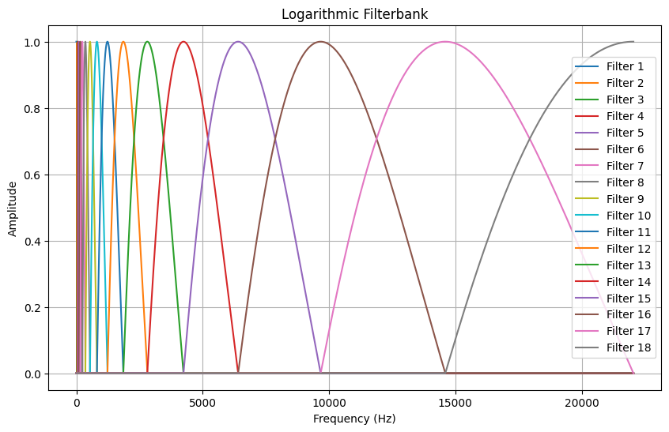
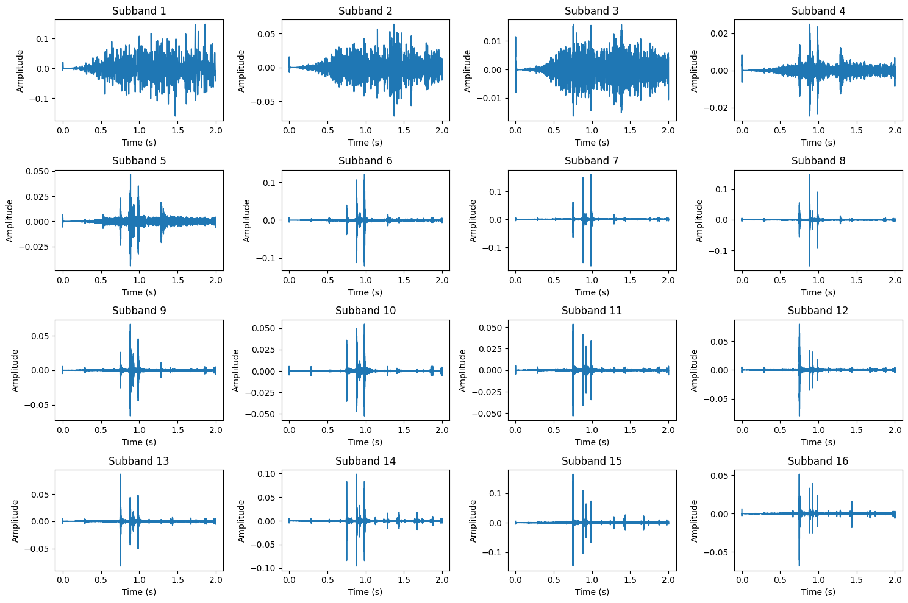

  
# torch_filterbanks

[**Esteban Gutiérrez**](https://github.com/cordutie)

*Music Technology Group, UPF*

## 1. Introduction

This repository contains a Filterbank implementations in PyTorch with automatic differentiation support for deep learning applications. 

The code in this repository mimics the one in the [Sound Texture Synthesis Toolbox](http://mcdermottlab.mit.edu/Sound_Texture_Synthesis_Toolbox_v1.7.zip) introduced by McDermott and Simoncelli in [[1]](#1).

## 2. How to Use

See `example.ipynb` notebook for examples. In it you will see how to create subband decompositions (Figure 1) and visualize the filterbanks (Figure 2).

Figure 1. Logarithmic Filterbank in the frequncy domain.
 

Figure 2. Subband decomposition over an ERB filterbank of 16 bands.
 

## 3. References

<a id="1">[1]</a> Josh H. McDermott, Eero P. Simoncelli,
Sound Texture Perception via Statistics of the Auditory Periphery: Evidence from Sound Synthesis,
Neuron,
Volume 71, Issue 5,
2011,
Pages 926-940,
ISSN 0896-6273,
https://doi.org/10.1016/j.neuron.2011.06.032.
